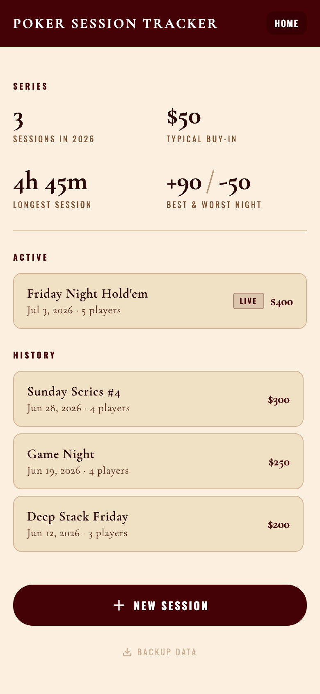
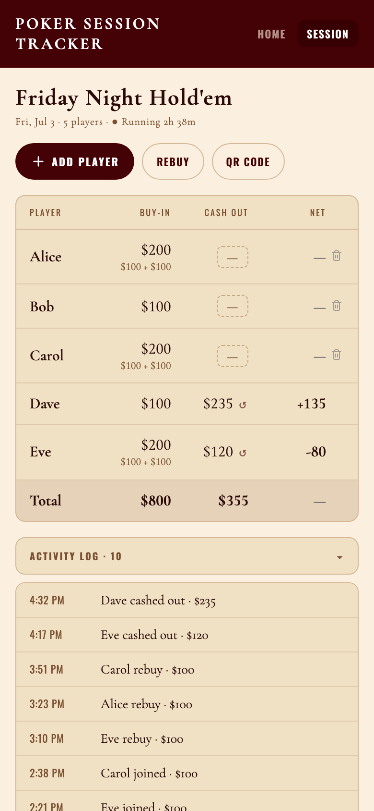
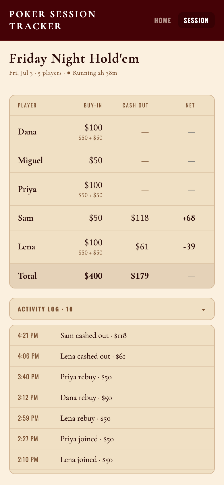

# Poker Session Tracker

  
  
  

Self-hosted web app for tracking buy-ins, cashouts, and balances during a home poker game. The host runs the session from a PIN-protected admin panel; players open a per-session link to follow it in the browser, read-only. All data is stored in a self-hosted Supabase database.

📖 **[Developer documentation](https://lmc4s.github.io/poker-tracker/docs/)** — architecture, data model, HTTP API reference, auth flow, and security model. ([source](docs/index.html))

  
  
  

  Admin home · a running session (admin) · the read-only view players see

## How sharing works

Each session has its own link of the form `https://<app>.vercel.app/s/<token>`. The host taps **QR Code** on an active session and players scan it with their phone to view an active session. 

- Anyone with the link sees that one session, read-only, refreshed every few seconds. The link stays valid after the session ends and shows final standings.
- The shared view has two tabs: **Session** (the linked game) and **Home** (series stats across all games — aggregate numbers only, no per-player history).
- The root URL (`/`, no token) shows only a prompt to open a shared link. No session list is exposed publicly.
- The host can **revoke** a session's link or **replace** it with a new one from the QR Code dialog. Revoking immediately invalidates the old link and any saved QR codes.

## Features

- Per-session share links with a scannable QR code — players follow a session live in any mobile browser, with no app install
- Share links can be revoked or replaced per session at any time
- Buy-ins, rebuys, tap-to-cash-out, and undo, with player-name autocomplete from past games
- Timestamped activity log for every buy-in, rebuy, and cash-out
- Session end time recorded automatically from the last cash-out
- Series stats that move with every game — sessions this year, days since the last night, money on the table this year, and last night's top win (the winner's name is shown to the host only, never to link viewers)
- Entries can't be lost to bad wifi — every action is a tiny operation queued on the device, retried until the server confirms it, and applied exactly once; an entry made with no signal survives a page refresh and syncs when signal returns
- Conflict-free multi-admin editing — each session versions independently, so two devices editing different sessions never collide, and the server keeps a permanent audit trail of every operation
- One-click JSON backup of all data
- Mobile-first layout
- Runs on the Vercel and Supabase free tiers

## Install

Requires free accounts on [Vercel](https://vercel.com) and [Supabase](https://supabase.com).

### Step 1 — Database

Create a Supabase project. In the **SQL Editor**, run each file in [`supabase/migrations/`](supabase/migrations/) in filename order. They create the tables (one row per session plus an operation ledger) and the row-level-security policies that deny all anonymous access.

From **Project Settings → API**, note two values:
- **Project URL** — e.g. `https://abcdefg.supabase.co`
- **service_role secret** — the longer JWT, kept private

### Step 2 — Deploy

The button below clones the repo, prompts for the keys from Step 1, and deploys to Vercel.

Required environment variables:

| Variable | Source |
|---|---|
| `SUPABASE_URL` | Supabase → Project Settings → API → Project URL |
| `SUPABASE_SERVICE_KEY` | Supabase → Project Settings → API → service_role secret |
| `ADMIN_PIN` | Admin password (any value) |
| `ADMIN_API_SECRET` | Generated with `openssl rand -hex 32` |

### Step 3 — Use

Vercel assigns a URL such as `https://<app>.vercel.app`.

- **Admin:** open `/admin`, enter the PIN, and create a session.
- **Players:** the host opens a session, taps **QR Code**, and players scan it (or open the link) to follow along. Each session has its own link.

A custom domain can be configured under the Vercel project's **Settings → Domains**.

## How it works

A React single-page app with two surfaces: a PIN-gated admin panel and a public, read-only observer view reached by a per-session token. Database access goes through Vercel serverless functions; no credentials are exposed to the browser.

Full architecture, data model, HTTP API reference, auth flow, and security model are in the **[developer documentation](https://lmc4s.github.io/poker-tracker/docs/)**.

## License

MIT
